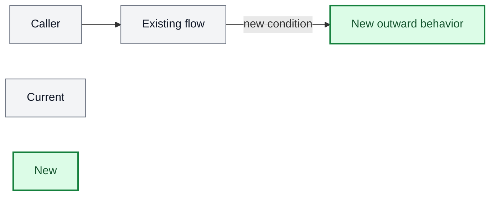

# PR description

Produce a review-facing account of the change, not a tour of its implementation.

## Establish the PR slice

Resolve the PR's base and head, then inspect the complete base-to-head diff, commits, existing body, and relevant public contracts or behavior tests. For a stacked PR, compare it with its immediate parent branch rather than with the repository's default branch. Finish this pass only when every changed public contract and externally observable behavior has been accounted for.

## Write the outward changes

Add or replace this section:

```markdown
## Outward changes

- ...
```

Keep it concise and name exact public concepts. Include whichever of these changed:

- API, event, schema, field, enum, command, or configuration contracts
- user- or system-visible lifecycle and state transitions
- feature flags, rollout boundaries, defaults, and fallback behavior
- deletion, retention, restoration, audit, authorization, or security effects
- deliberate exceptions to an established behavior

State behavior as old state → new state when that distinction matters. If the intent of a destructive or compatibility-sensitive behavior is uncertain, make it an explicit reviewer question instead of smoothing it over. Say that there is no outward change when the diff is purely internal.

Use internal class or method names only when they are themselves a public seam or are necessary to locate a reviewer concern.

## Draw the architecture

Add or replace an `## Architecture` section containing one high-level Mermaid flowchart. Use boxes for actors, systems, services, stores, public APIs, or lifecycle stages. Keep internal classes and helper calls out of the diagram.

Current context is gray and new behavior is green. Every node that represents new behavior must use `:::new`; every existing-context node must use `:::current`. When an existing component gains behavior, split the old and new behavior into separate nodes so the color remains unambiguous. Include a legend.

Use these styles consistently:



Validate every diagram with an available Mermaid validator. Invoke `domain-modeling:validating-mermaid` when it is installed. If no deterministic validator is available, report that limitation in the handoff rather than claiming validation.

## Apply the body

Preserve unrelated sections such as stack context, scope, verification, screenshots, and follow-ups. When the user authorized a live PR mutation, write the complete body through a file and use the GitHub CLI's body-file option; then read the body back from GitHub. Otherwise return the proposed Markdown without changing GitHub.

The description is ready when every outward delta appears once, the diagram separates current and new behavior by color, validation status is known, and any live update has been read back.
